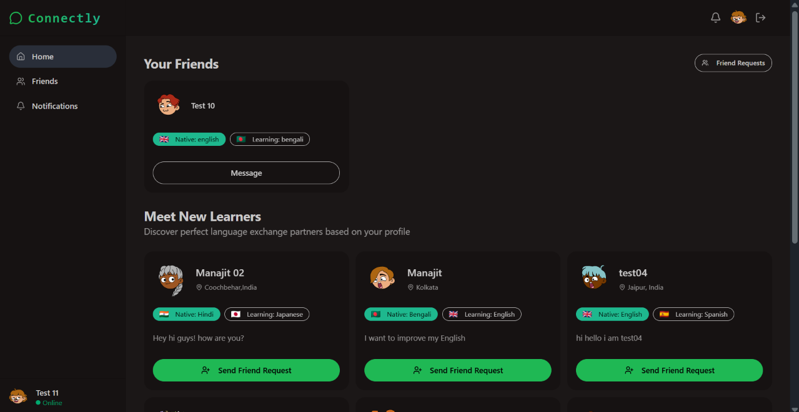

# Connectly

Real-time language exchange platform that helps users discover language partners, build connections, and communicate through real-time chat and video calls.

### 🔗 Live Demo

[Connectly](https://connectly-yf87.onrender.com/)




## ✨ Key Features

-  **Language Partner Discovery** — Find and connect with users based on their native and learning languages.
-  **Connections & Notifications** — Send, receive, and manage friend requests.
-  **Real-Time Communication** — Chat and video call with language partners using Stream.
-  **Authentication & Profiles** — JWT authentication with secure onboarding and profile management.
-  **Responsive UI** — Modern responsive interface built with React, Tailwind CSS, and DaisyUI.

## 🛠️ Technology Stack

### Frontend
- React
- Vite
- React Router
- TanStack Query
- Axios
- Tailwind CSS
- DaisyUI
- Lucide React

### Backend
- Node.js
- Express.js
- MongoDB
- Mongoose
- JWT
- bcryptjs
- Cookie Parser

### Real-Time Communication
- Stream Chat
- Stream Video

### Deployment
- Render

## ⚙️ How It Works

### 🌍 Language Partner Discovery

Users complete onboarding by providing their **native language**, **learning language**, **bio**, and **location**. Connectly uses this information to display other onboarded users who can potentially be language-learning partners.

### 🤝 Friend Requests

Users can send friend requests to other language learners. Pending requests are tracked separately, allowing users to see requests they have already sent while recipients can manage incoming requests through the notifications page.

Once a request is accepted, both users are added to each other's friends list.

### 💬 Real-Time Chat

After connecting with another user, they can start a real-time conversation using **Stream Chat**. Stream handles the real-time messaging infrastructure while Connectly manages user authentication and application-level relationships.

### 📹 Video Calling

Users can initiate video calls with their connected language partners using **Stream Video**. The application generates authenticated Stream tokens from the backend before establishing the video session.

### 🔐 Authentication & Protected Routes

Users can register and log in using their email and password. Passwords are hashed using **bcrypt**, while **JWTs stored in HTTP-only cookies** are used to maintain authenticated sessions.

Protected routes ensure that authenticated users complete onboarding before accessing the main application.

### 🔄 Stream User Synchronization

When users register or update their profile, Connectly synchronizes their information with **Stream** using the Stream server SDK. This keeps chat and video user information consistent with the application's MongoDB user data.

## 📁 Project Structure

```text
connectly/
├── backend/
│   ├── src/
│   │   ├── config/          # Database and Stream configuration
│   │   ├── controllers/     # Authentication, user, and chat logic
│   │   ├── middlewares/     # Authentication middleware
│   │   ├── models/          # Mongoose models
│   │   ├── routes/          # API routes
│   │   └── app.js
│   ├── server.js
│   └── package.json
│
├── frontend/
│   ├── src/
│   │   ├── components/      # Reusable UI components
│   │   ├── constants/       # Application constants
│   │   ├── hooks/           # Custom React hooks
│   │   ├── lib/             # API and Axios configuration
│   │   ├── pages/           # Application pages
│   │   ├── App.jsx
│   │   ├── index.css
│   │   └── main.jsx
│   └── package.json
│
├── screenshots/             # README project screenshots
├── .gitignore
├── package.json
└── README.md
```

## 📦 Installation & Setup

### 1. Clone the repository

```bash
git clone https://github.com/manajitsaha18/connectly.git
cd connectly
```


### 2. Install Backend Dependencies

```bash
cd backend
npm install
```

### 3. Install Frontend Dependencies

```bash
cd ../frontend
npm install
```

### 4. Configure Environment Variables

Create a `.env` file inside the `backend` directory:

```env
PORT=3000
MONGO_URI=your_mongodb_connection_string
JWT_SECRET=your_jwt_secret

STREAM_API_KEY=your_stream_api_key
STREAM_API_SECRET=your_stream_api_secret

NODE_ENV=development
```

Create a `.env` file inside the `frontend` directory:

```env
VITE_STREAM_API_KEY=your_stream_api_key
```

> Replace the placeholder values with your own credentials. Never commit `.env` files or private keys to version control.

### 5. Start the Backend

Open a terminal from the project root:

```bash
cd backend
npm run dev
```

### 6. Start the Frontend

Open another terminal:

```bash
cd frontend
npm run dev
```

The Vite development server will display the local frontend URL in the terminal.

## 🚀 Deployment

The application is deployed using:

- **Hosting:** Render
- **Frontend:** React production build served by Express
- **Backend:** Node.js + Express
- **Database:** MongoDB Atlas
- **Real-Time Communication:** Stream Chat & Stream Video

Production environment variables are configured separately on Render.
